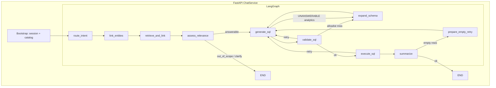

# System architecture


Editable source: [architecture.svg](./architecture.svg). High-level poster for demos and reviews; details below match current code (`backend/app/`).

Related docs:

- Root [README.md](../README.md) — setup, typical flow, schema linking, keep-alive / Render tips
- [backend/README.md](../backend/README.md) — API, LangGraph pipeline, TTS, scripts
- [frontend/README.md](../frontend/README.md) — UI flow, Evidence refresh, E2E
- [backend/scripts/sales_extended/README.md](../backend/scripts/sales_extended/README.md) — multi-table sales demo warehouse
- [`.env.example`](../.env.example) — backend Settings; [frontend/.env.local.example](../frontend/.env.local.example) — Next proxy

## What the diagram shows

| Layer | Role |
|-------|------|
| **Client** | Next.js on Vercel — auth, connect/upload, chat + charts, Web Speech STT, Piper speak |
| **API** | FastAPI on Render — `/api/auth`, `/api/data`, `/api/chat`, `/api/voice`, `/health` |
| **LangGraph** | Full chat agent: IntentRouter → EntityLinker → RAG/FK → scope → SQL loop → summarize (+ expand / empty-result retries) |
| **Data & AI** | App Postgres + pgvector; user warehouse (read-only); OpenRouter (LLM + embeddings) |
| **Voice / security** | Browser STT; offline Piper TTS; httpOnly cookies; SELECT-only SQL; rate limits |

> **Note:** Health checks are `/health` (not `/api/health`). Same-origin `/api` proxy is used for cookie auth.

## Chat pipeline — full flow under LangGraph

Industry practice for Text2SQL agents (LangGraph / agent graphs): **one compiled graph** owns soft NLP, retrieval, scope, SQL retries, and summarization so stages are observable (SSE) and edges own recovery.

`ChatService` only **bootstraps** (auth, chat session, history, catalog load), then `ainvoke` / `astream` the graph. Persistence stays outside the graph.



| Node | Role |
|------|------|
| `route_intent` | IntentRouter (small-token JSON) |
| `link_entities` | EntityLinker (analytics / follow-up) |
| `retrieve_and_link` | Cosine RAG + FK expand + allowlist freeze |
| `assess_relevance` | Scope gate (trusts IntentRouter when confident) |
| `generate_sql` → `validate_sql` → `execute_sql` | SQL loop with sqlglot hard rails |
| `expand_schema` | One-shot deeper linking on allowlist miss / UNANSWERABLE BI asks |
| `prepare_empty_retry` / `resolve_empty_retry` | One rewrite after zero rows; keep better outcome |
| `summarize` | NL answer from rows |

**Outside LangGraph (by design):** JWT/auth, data-source decrypt, chat session CRUD, message persistence, TTS.

## Soft NLP + hard rails (domain-agnostic)

| Layer | Mechanism |
|-------|-----------|
| Intent + entities | Small-token LLM JSON (`NLP_PREFER_LLM`, optional `LLM_ROUTER_MODEL`) |
| Schema vocabulary | Derived from **this** warehouse’s columns (`schema_vocab`) |
| Retrieval | Embeddings + FK expand (`RAG_*`) |
| SQL safety | sqlglot SELECT-only + table allowlist |
| Heuristics | Fallback only when the LLM errors / returns invalid JSON |

Offline eval: `make eval` → `backend/tests/eval/` (sales + HR + IoT generic packs).

## Schema linking (graph detail)

1. **route_intent** — `catalog_overview | analytics | follow_up | out_of_scope | clarify`
2. **link_entities** (analytics / follow-up) — tables / measures / dimensions from schema
3. **retrieve_and_link** — cosine top-K → FK expand (`RAG_EXPAND_HOPS`, `RAG_MAX_TABLES`)
4. Catalog overview path — names-only inventory for full-DB summary asks
5. On allowlist miss / thin UNANSWERABLE — **expand_schema** once (`RAG_EXPAND_ON_RETRY`)

UI: **Refresh schema index** (Evidence → `POST /api/data/embed-schema`) after warehouse DDL.

## End-to-end

```text
Ask (voice/text)
  → Bootstrap session + catalog
  → LangGraph: intent → entities → RAG/FK → scope → SQL → summarize
  → rows → chart
  → optional Piper speak
```

Streaming: `POST /api/chat/stream` (SSE stages for every LangGraph node).
