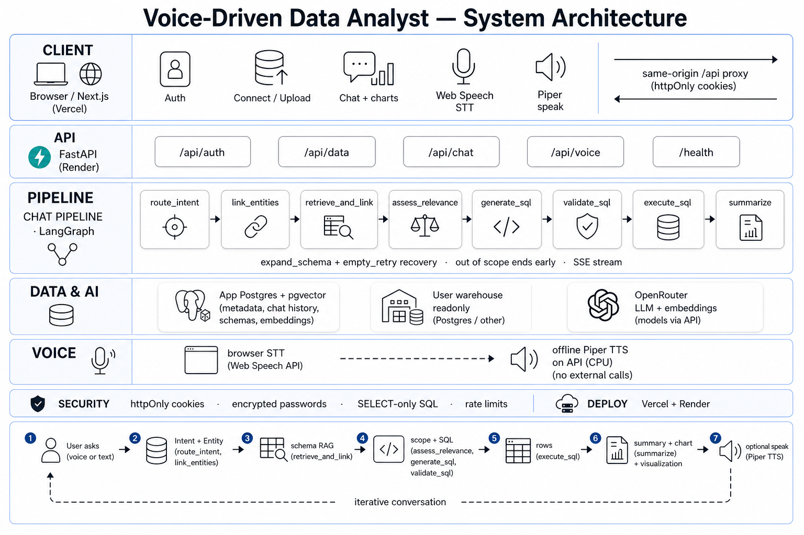

# System architecture



High-level system poster for demos and reviews. The diagram is the **layer / deploy view**; schema-linking details below match current code (`backend/app/`).

Related docs:

- Root [README.md](../README.md) — setup, typical flow, schema linking
- [backend/README.md](../backend/README.md) — API, prepare + LangGraph pipeline, scripts
- [frontend/README.md](../frontend/README.md) — UI flow, Evidence refresh, E2E
- [backend/scripts/sales_extended/README.md](../backend/scripts/sales_extended/README.md) — multi-table sales demo warehouse

## What the diagram shows

| Layer | Role |
|-------|------|
| **Client** | Next.js on Vercel — auth, connect/upload, chat + charts, Web Speech STT, Piper speak |
| **API** | FastAPI on Render — `/api/auth`, `/api/data`, `/api/chat`, `/api/voice`, `/health` |
| **Chat pipeline** | LangGraph: retrieve schema → assess relevance → generate / validate / execute SQL → summarize |
| **Data & AI** | App Postgres + pgvector; user warehouse (read-only); OpenRouter (LLM + embeddings) |
| **Voice / security** | Browser STT; offline Piper TTS; httpOnly cookies; SELECT-only SQL; rate limits |

> **Note:** Health checks are served at `/health` (not `/api/health`). Same-origin `/api` proxy is used for cookie auth.

## Schema linking (not drawn as separate boxes)

Before the graph runs, `ChatService` prepare does industry-style linking:

1. **Cosine top-K** (`RAG_TOP_K`, default 5) — seed chunks from the schema index.
   Index stores **one chunk per table** plus two warehouse-wide overview chunks:
   - `catalog_overview` — full table inventory (summary / all-tables asks)
   - `relationship_graph` — ER / FK edge list (join-path asks)
2. **FK expand** (`RAG_EXPAND_HOPS`, `RAG_MAX_TABLES`) — neighboring tables into context + allowlist
   (overview chunks do not consume the real-table budget).
3. **Catalog overview path** — NL like “summary of db” *or* retrieval of the catalog
   overview chunk → allowlist **every** indexed table (not capped at `RAG_MAX_TABLES`).
4. LangGraph SQL loop against that allowlist (retries as in the diagram).
5. On allowlist miss, **one** expand-and-retry (`RAG_EXPAND_ON_RETRY`).

In the UI, **Refresh schema index** (Evidence panel → `POST /api/data/embed-schema`) re-indexes after warehouse DDL so RAG + FK metadata stay current. After this chunking change, refresh once so the two overview chunks are embedded.

## End-to-end

```text
Ask (voice/text)
  → schema RAG + FK expand
  → scope gate (clarify / out-of-scope may end early)
  → SQL generate → validate → execute (retries)
  → rows → summary + chart
  → optional Piper speak
```

Streaming: `POST /api/chat/stream` (SSE stages).
